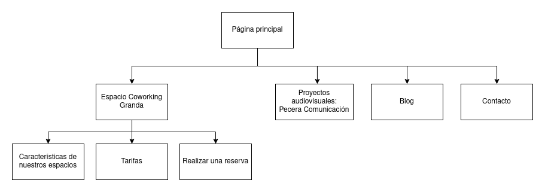

# COWORKING

# Introducción

## ¿Qué es el coworking?

El coworking es una metodología de trabajo y organización que cada día se esta volviendo más popular entre trabajadores autónomos. Se define como una evolución lógica del trabajo colaborativo, en la que estos profesionales comparten un espacio de trabajo en el que realizar sus propias tareas, ya sea de manera individual o en grupo.

El coworking se presenta como una alternativa más personal al trabajo en empresas en la que se organizan, y al mismo tiempo, se separa a la gente en distintos departamentos. Al estar en un mismo entorno más reducido, se da la posibilidad de que todas estas personas puedan aportar su apoyo entre sí. Se logra un entorno de trabajo mucho más personalizado y un entorno que promueve a las relaciones sociales y al trabajo cooperativo.

A raíz del surgir de esta metodología de trabajo se han comenzado a difundir los espacios de coworking. Este es el caso de erranT y de Kubicate, dos empresas que ofrecen sus oficinas como un entorno de coworking en el que practicar esta metodología y desarrollar proyectos y trabajos de manera cooperativa. Se ofrece reservas de espacios con un horario ajustable, acceso a material de trabajo como internet, zonas de descanso, salas de reuniones... y talleres y cursos, entre otros. El resultado es un lugar de trabajo mucho mas flexible que el ofrecido por empresas y organizaciones más tradicionales.

En esta práctica observaremos una de las páginas de los servicios mencionados anteriormente y realizar un rediseño de estas, con el objetivo de brindar al usuario una mejor experiencia de uso y arreglar cualquier posible fallo de diseño que encontremos.

# Investigación de la página

Competitive Analysis
-----

El primer paso es seleccionar la empresa cuya página web será rediseñada. De las dos opciones que se nos han presentado, se ha tomado la decisión de realizar un análisis de la página de coworking **erranT**, frente a la página de **Cubikate**. 

Ambas páginas presentan las mismas funcionalidades: ofrecen explicaciones sobre que es coworking, información de sus instalaciones y sus servicios. Teniendo en cuenta esto, se ha seleccionado erranT debido a su diseño minimalista pero elegante, su enfoque en la presentación de la información, y por la manera en la que presenta el coworking no solo como una metodología de trabajo, sino como una comunidad de trabajadores que colaboran y conectan entre sí. 

Usability Review
----
Se ha realizado una Usability Review de la página observada, [obteniendo así el siguiente documento](docs/Usability-review-erranT.pdf).

La página presenta algunos errores que pueden arruinar la UX Experience significantemente. La estructura de la página es muy básica, teniendo muy pocas secciones, pero a pesar de esto no ofrece a los usuarios opciones de navegabilidad más allá del menú de navegabilidad de la sección superior, que es fijo y no puede ser accedido a no ser que se suba arriba del todo, interrumpiendo el posible flujo del trabajo del usuario cada vez que se quiera navegar de una página a otra. 

Hay páginas que deberían de estar enlazadas lógicamente, como la sección de Alquiler y de Tarifas, que no lo están. Por lo general, la navegación es muy tosca, y las páginas no se sienten conectadas entre sí. Esta desconexión entre las distintas páginas se nota además en al falta de opciones como una opción de búsqueda global o de filtrado y/o ordenado de artículos en la sección de blog.

Además, la página no posee funcionalidades como la reserva de espacios, redirigiendo al usuario al formulario de Contacto genérico. Este formulario es muy tosco y podría ser mejor refinado, junto con la explicación que lo acompaña, que está puesta en un lateral  y es demasiado extensa, haciendo que sea muy fácil pasarla por alto.

Realizando algunos ligeros cambios en el diseño y estructura de la página se podría conseguir mejorar significativamente la experiencia de usuario. También se podría añadir más funcionalidades, a mi parecer bastantes fundamentales en este tipo de negocios, para darle más uso a la página y darle un mayor propósito más allá de recoger información de la página.

## Nueva propuesta de diseño

El nuevo diseño de la página busca reestructurar la página para hacer la navegación más sencilla y más intuitiva. Se cambiarán los nombres de las secciones a nombres más intuitivos y descriptivos, y se enlazará de mejor manera las secciones. Se creará un menú de migas de pan para hacer más accesible la navegación, y se creará una barra de búsqueda que permita realizar búsquedas globales de artículos o zonas de interés de la página.

Se creará una nueva página de reserva que permita reservas espacios, mostrando un calendario de horarios disponibles y un formulario especial para esta petición, añadiendo así esta nueva funcionalidad.

En general, se retocará el diseño del contenido de la página para aprovechar mejor el espacio y para mostrar mejor el contenido. En particular, la zona de blog se reestructurará para mostrar mejor los artículos y rellenar el espacio vacío, y la zona de contacto se reestructurará para mostrar mejor las distintas opciones de contacto y mostrar una explicación menos densa y más fácil de leer. También se modificará el formulario para que sea más interactivo e intuitivo. 

  # Rediseño de la página

Sitemap 
-----

Se ha diseñado el siguiente sitemap para representar la nueva estructura de la página web.

----
